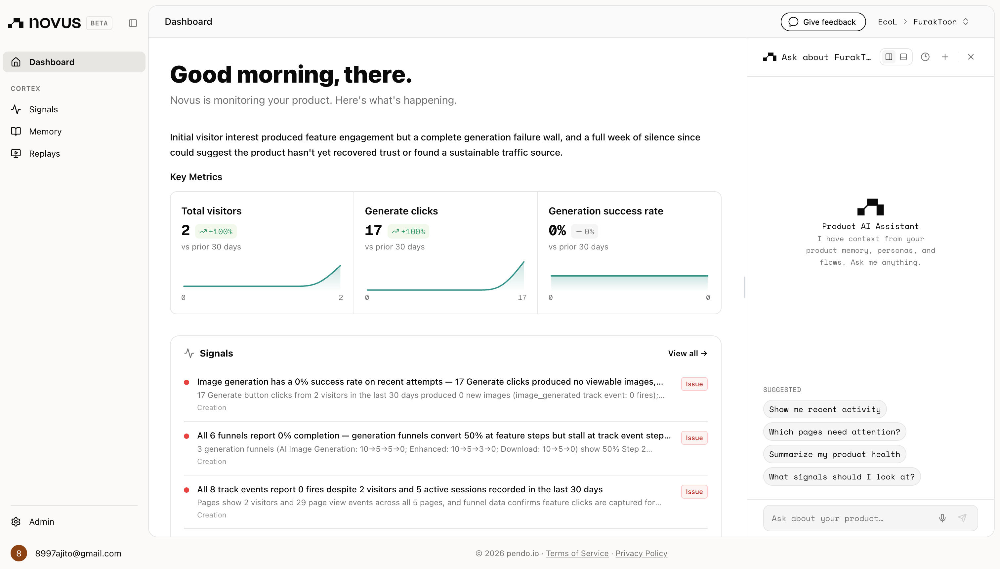

# FurakToon 🎨

**Beautiful cartoons, made by you.** FurakToon is an AI web app that turns a
short idea into an anime or cartoon character in seconds — pick a style, hit
generate, and download your creation. _Furak_ means "beautiful" in Tetum
(Timor-Leste).

Built for the **Mind the Product — World Product Day 2026** hackathon
("Everyone Ships Now").

🔗 **Live app: [furaktoon.fun](https://www.furaktoon.fun/)**

---

## 🏁 Hackathon eligibility

- **New project for this hackathon.** First commit on **Jun 4, 2026** —
  [`75cb0c6`](https://github.com/ajitonelsonn/FurakToon/commit/75cb0c6ae7f1f80ad3ec58bc694a4868fd207f92)
  (well after the May 20 start date).
- **Deployed & public:** [furaktoon.fun](https://www.furaktoon.fun/) — a stranger
  can land on the URL and create an image right now.
- **Novus.ai installed** (required) — see below.

---

## 📊 Analytics — Novus.ai (installed)

The required **Novus.ai** product analytics is installed on the deployed app.
Novus runs on **Pendo**, so it's wired in via the Pendo agent loaded in
[`furaktoon-app/src/app/layout.tsx`](furaktoon-app/src/app/layout.tsx) plus
server-side event tracking in
[`furaktoon-app/src/lib/pendo.ts`](furaktoon-app/src/lib/pendo.ts). It captures
page loads and key product events (sign-up, login, generations, downloads,
moderation blocks, out-of-credits).



---

## What it does

- 🖌️ **Generate** anime or cartoon images from a text prompt (Together AI).
- 🧑‍🎨 **Reference faces** — upload a photo to put a real person into the art.
- ✨ **AI prompt enhancement** and **two-layer content safety**.
- 🪙 **Credits** — 10 free per month (1 per image, 2 with a reference).
- 🖼️ **Personal gallery**, 🌗 **light/dark mode**, and **21 languages**.

## Repo layout

| Path                          | What's inside                                   |
| ----------------------------- | ----------------------------------------------- |
| [`furaktoon-app/`](furaktoon-app/) | The Next.js application (all source code)   |
| `images/ss/`                  | Screenshots used in the docs                     |

## 📖 Full documentation

Setup, environment variables, architecture, and screenshots of every page live
in the app README:

➡️ **[furaktoon-app/README.md](furaktoon-app/README.md)**

```bash
cd furaktoon-app
npm install
npm run dev
```

---

_FurakToon — furak means "beautiful" in Tetum 🇹🇱 · Mind the Product Hackathon 2026_
