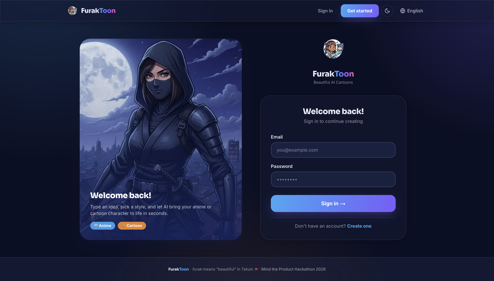
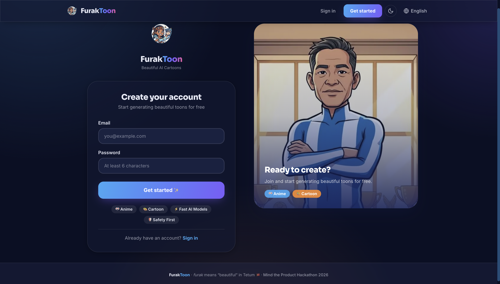
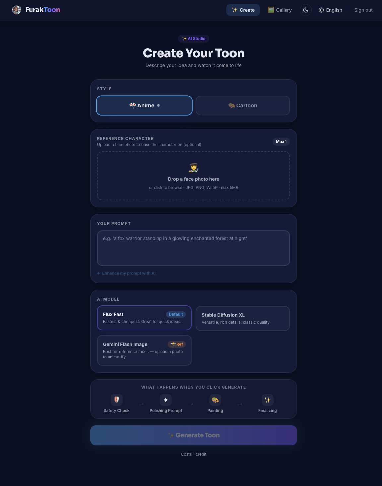
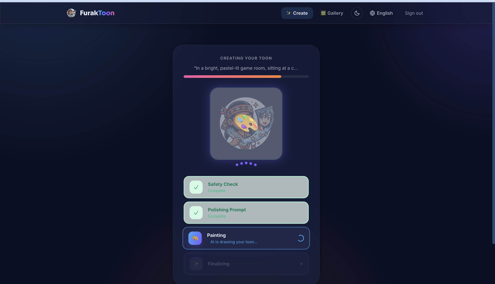
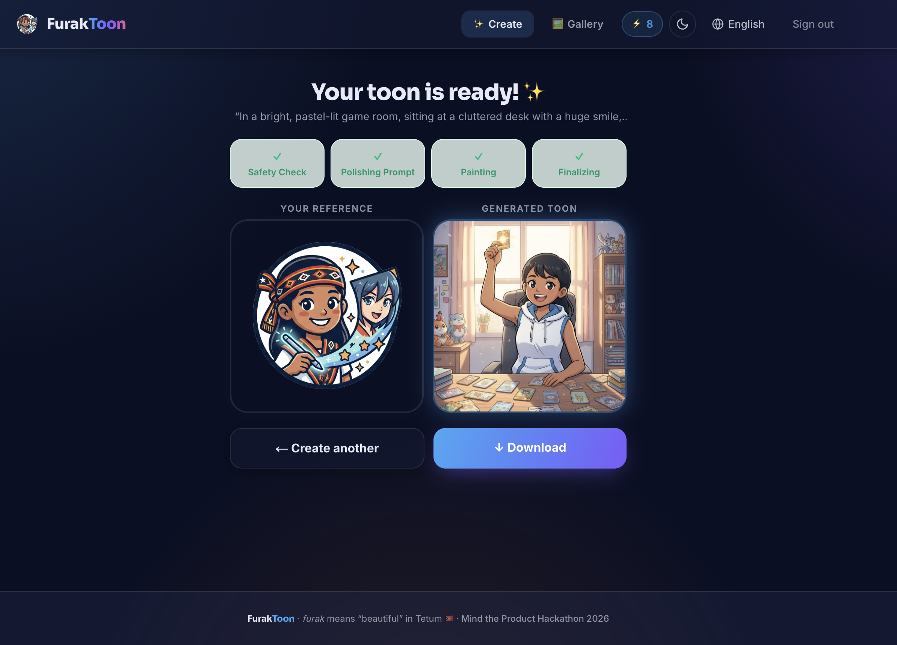
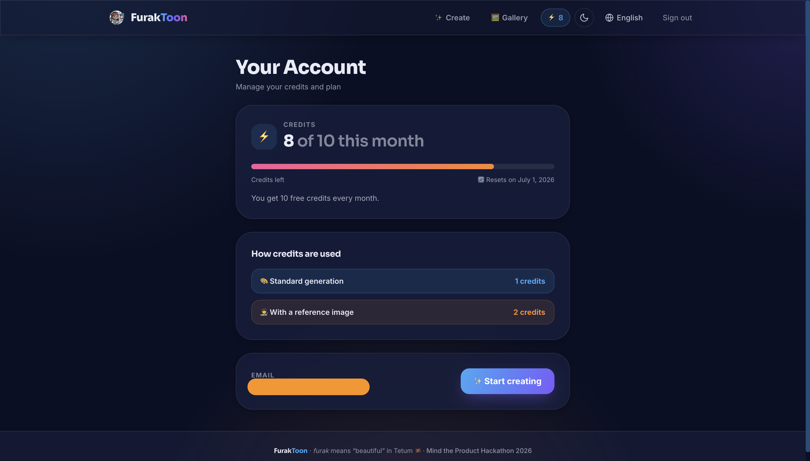
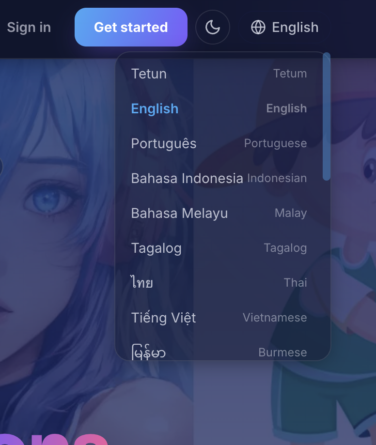

# FurakToon 🎨

**Beautiful cartoons, made by you.** FurakToon is an AI image-generation web app
that turns a short idea into an anime or cartoon character in seconds. _Furak_
means "beautiful" in Tetum (Timor-Leste).

Built for the Mind the Product Hackathon 2026.

---

### Landing page (logged out)

Hero with showcase artwork + the live database-status indicator.


### Sign in / Sign up

Split-screen auth with artwork panel.

| Login                            | Register                               |
| -------------------------------- | -------------------------------------- |
|  |  |

### Dashboard (logged in)

Welcome banner, quick actions, and recent creations.


### Create — prompt form

Style toggle, reference upload, model picker, and the cost/credits hint.



### Create — generation process

Live progress bar with safety → enhance → painting → finalizing steps.



### Create — result

The finished toon with download + "create another".



### Gallery

All of a user's saved creations.


### Account & credits

Balance, monthly allowance, reset date, and credit costs.



### Dark mode & languages

System-aware dark mode and the 21-language switcher.

| Dark mode                                | Language switcher                        |
| ---------------------------------------- | ---------------------------------------- |
|  |  |

---

## ✨ Features

- **AI image generation** — type a prompt, pick **Anime** or **Cartoon**, and
  generate a 1024×1024 image via [Together AI](https://together.ai).
- **Reference faces** — upload a face photo and the Gemini Flash Image model
  redraws that person in your chosen scene/style.
- **AI prompt enhancement** — one click rewrites your idea into a richer prompt
  (Llama 3.3 70B).
- **Two-layer safety** — every prompt is moderated by an LLM before generation
  (client pre-check + server-side enforcement).
- **Personal gallery** — every creation is stored and browsable per user.
- **Credits system** — 10 free credits per user per month (1 per image, 2 when
  using a reference image). Resets monthly.
- **21 languages** — full i18n with a Southeast-Asia focus (Tetum, English,
  Portuguese, Indonesian, Malay, Tagalog, Thai, Vietnamese, and more), incl.
  RTL for Arabic.
- **Light / dark mode** — system-aware with a manual toggle, no flash on load.
- **Live DB status** — the landing page shows whether Supabase is reachable
  (handy on the free tier, which pauses idle projects).
- **Product analytics** — Pendo event tracking (client + server).

---

## 🧱 Tech stack

| Layer     | Choice                                                     |
| --------- | ---------------------------------------------------------- |
| Framework | **Next.js 16** (App Router, React 19, Turbopack)           |
| Language  | TypeScript                                                 |
| Styling   | **Tailwind CSS v4** + custom design system (`globals.css`) |
| Fonts     | Sora (display) + Inter (body) via `next/font`              |
| Auth + DB | **Supabase** (Postgres, Auth, Storage, RLS)                |
| AI models | **Together AI** — image gen + Llama 3.3 70B for text       |
| Analytics | Pendo                                                      |

---

## 🚀 Getting started

### 1. Install

```bash
npm install
```

### 2. Configure environment

Create `.env.local` in the project root:

```bash
# Together AI (image generation + prompt enhancement + moderation)
TOGETHER_API_KEY=your_together_api_key

# Supabase
NEXT_PUBLIC_SUPABASE_URL=https://YOUR_PROJECT.supabase.co
NEXT_PUBLIC_SUPABASE_ANON_KEY=your_anon_key
SUPABASE_SERVICE_ROLE_KEY=your_service_role_key   # server-only, for uploads/credits

# Pendo (optional analytics)
NEXT_PUBLIC_PENDO_API_KEY=your_pendo_key
```

> The Together SDK reads `TOGETHER_API_KEY` automatically. The **service role
> key must never be exposed to the client** — it's only used in server routes
> for Storage uploads and credit RPCs.

### 3. Set up the database

In the Supabase **SQL Editor**, run the migration that creates the credits
table, the new-user trigger, and the refill/spend functions:

```
supabase/migrations/0001_credits.sql
```

You also need a Storage bucket named **`images`** (public) and a `generations`
table (`id`, `user_id`, `prompt`, `style`, `model`, `image_url`, `created_at`).

### 4. Run

```bash
npm run dev
```

Open [http://localhost:3000](http://localhost:3000).

### Scripts

| Command         | Description                      |
| --------------- | -------------------------------- |
| `npm run dev`   | Start the dev server (Turbopack) |
| `npm run build` | Production build                 |
| `npm run start` | Serve the production build       |
| `npm run lint`  | ESLint                           |

---

## 🗂️ Project structure

```
src/
├── app/
│   ├── layout.tsx           # Root layout: providers (theme, i18n, credits), navbar, footer
│   ├── page.tsx             # Home — server component, branches on auth
│   ├── HomeViews.tsx        # Marketing hero (logged out) + dashboard (logged in)
│   ├── create/page.tsx      # The generator: form → progress → result
│   ├── gallery/             # User's saved creations
│   ├── account/             # Credit balance, allowance, reset date
│   ├── auth/                # login + register (split-screen UI)
│   ├── actions/auth.ts      # Server actions: login / register / logout
│   ├── api/
│   │   ├── generate/        # Core: moderate → charge credits → generate → store
│   │   ├── enhance/         # LLM prompt rewrite
│   │   ├── safety/          # LLM moderation (client pre-check)
│   │   └── health/          # Supabase reachability probe
│   └── globals.css          # Design tokens, glass/surface utilities, dark mode
├── middleware.ts            # Route protection + auth redirects
├── components/              # Navbar, switchers, badges, showcase, etc.
└── lib/
    ├── supabase/            # Browser, server, and service-role clients
    ├── credits.ts           # Cost constants + types (shared)
    ├── credits.server.ts    # getBalance / spend / refund (RPC wrappers)
    ├── credits/context.tsx  # Client credit-balance provider
    ├── theme/context.tsx    # Light/dark provider + anti-flash script
    ├── i18n/                # translations + locale dictionaries (21 langs)
    ├── models.ts            # Image model catalog
    └── pendo.ts             # Server-side event tracking
```

---

## 🔄 How it works

### Auth & route protection

- Supabase email/password auth. Sessions live in cookies, refreshed in
  [`middleware.ts`](src/middleware.ts) on every request.
- The middleware **protects `/create` and `/gallery`** (redirects to login) and
  bounces logged-in users away from the auth pages. `/account` guards itself
  server-side.
- Three Supabase clients in [`lib/supabase`](src/lib/supabase): **browser**
  (anon), **server** (anon, cookie-aware), and **service role** (privileged,
  server-only).

### The generation pipeline

When you click **Generate** on `/create`, the client walks through visible
steps while the server does the real work in
[`api/generate/route.ts`](src/app/api/generate/route.ts):

1. **Safety check** — the prompt is moderated (`/api/safety` client pre-check,
   then re-checked server-side). Unsafe prompts are blocked.
2. **Charge credits** — `spend_credits()` deducts the cost up front
   (**1** normal, **2** with a reference image) atomically. Out of credits → the
   request is rejected with HTTP `402`.
3. **Reference upload** (if used) — the face photo is uploaded to Supabase
   Storage so the model can fetch it.
4. **Generate** — Together AI renders the image using the selected model and a
   style-tuned prompt. If a reference is used, the prompt is prefixed with
   face-preservation instructions.
5. **Store & save** — the image is uploaded to Storage and a row is inserted
   into `generations`. On failure, the charged credits are **refunded**.

Prompt enhancement (`/api/enhance`) is a separate optional step that rewrites
the user's idea with Llama 3.3 70B before generation.

### Image models

Defined in [`lib/models.ts`](src/lib/models.ts):

| Model               | Provider id                                | Reference faces |
| ------------------- | ------------------------------------------ | --------------- |
| Flux Fast (default) | `black-forest-labs/FLUX.1-schnell`         | ❌              |
| Stable Diffusion XL | `stabilityai/stable-diffusion-xl-base-1.0` | ❌              |
| Gemini Flash Image  | `google/flash-image-2.5`                   | ✅              |

Uploading a reference photo auto-switches to a model that supports it.

### Credits

- New users get **10 credits** via a Postgres trigger on signup; existing users
  are backfilled.
- Balance **resets to 10 at the start of each month** (lazy refill — applied on
  the next read/spend, no cron needed). No rollover.
- Spending and refunds are atomic Postgres functions (`spend_credits`,
  `refund_credits`), so concurrent generations can't double-spend. RLS lets
  users read only their own balance.
- The balance is surfaced in the **navbar badge**, the **create page**, and the
  **/account** page.

### Internationalization

- A lightweight custom i18n in [`lib/i18n`](src/lib/i18n): a typed key set with
  one dictionary per locale, English as the fallback.
- Locale is stored in `localStorage` and applied via `useSyncExternalStore`;
  `dir="rtl"` is set for Arabic. Switch languages from the navbar.

### Theming

- [`theme/context.tsx`](src/lib/theme/context.tsx) resolves **system / light /
  dark**, persists the choice, and injects a tiny inline script in `<head>` to
  set the theme **before first paint** (no flash). Semantic CSS tokens in
  `globals.css` flip the whole UI under `.dark`.

### Database health indicator

The logged-out landing page shows a small status pill backed by
[`api/health`](src/app/api/health/route.ts), which pings Supabase's REST
endpoint with a short timeout. Any response = **online**; a timeout (a paused
free-tier project) = **offline**. It re-checks every 5 minutes.

---

## ☁️ Deployment

Deploy on [Vercel](https://vercel.com/new). Set all the environment variables
from `.env.local` in the project settings. Ensure the Supabase migration has
been run and the `images` Storage bucket exists.

---

_FurakToon — furak means "beautiful" in Tetum 🇹🇱_
